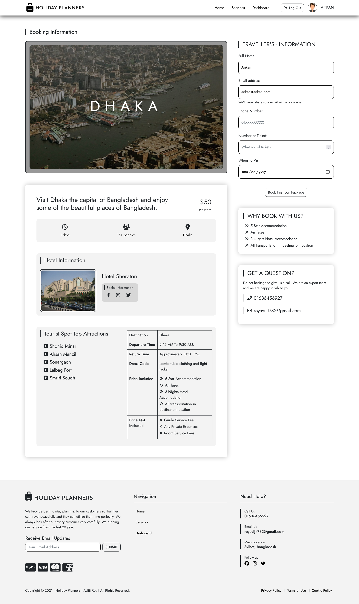
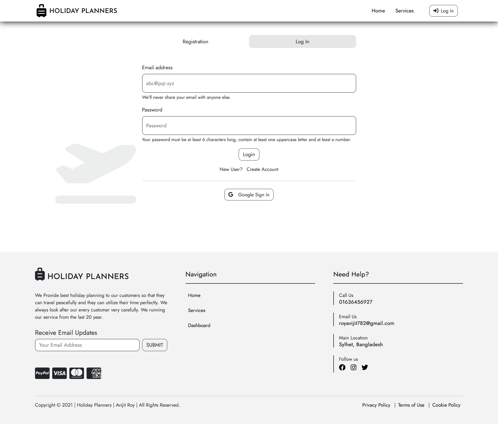
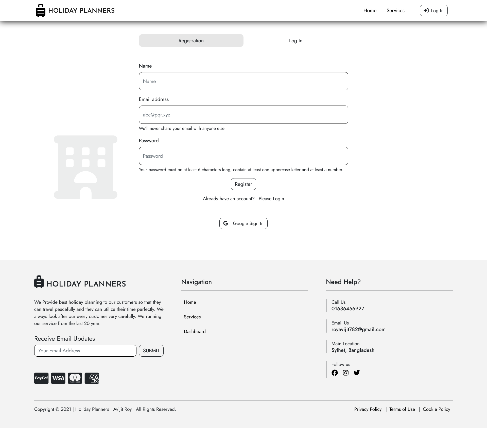
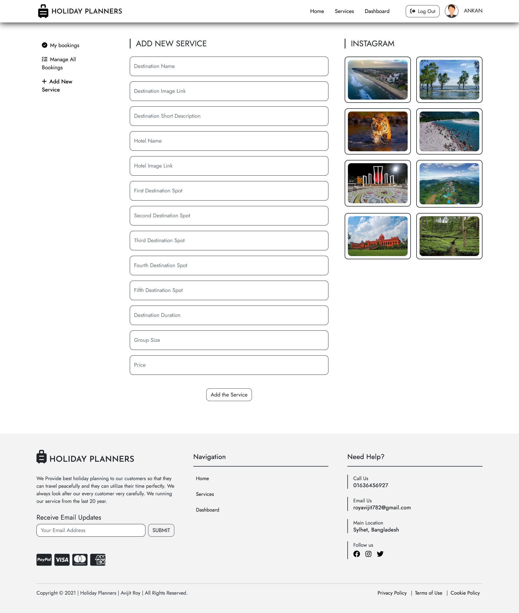
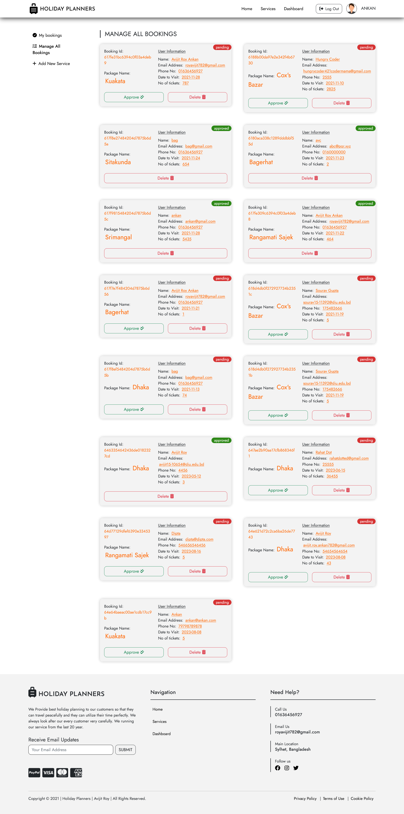
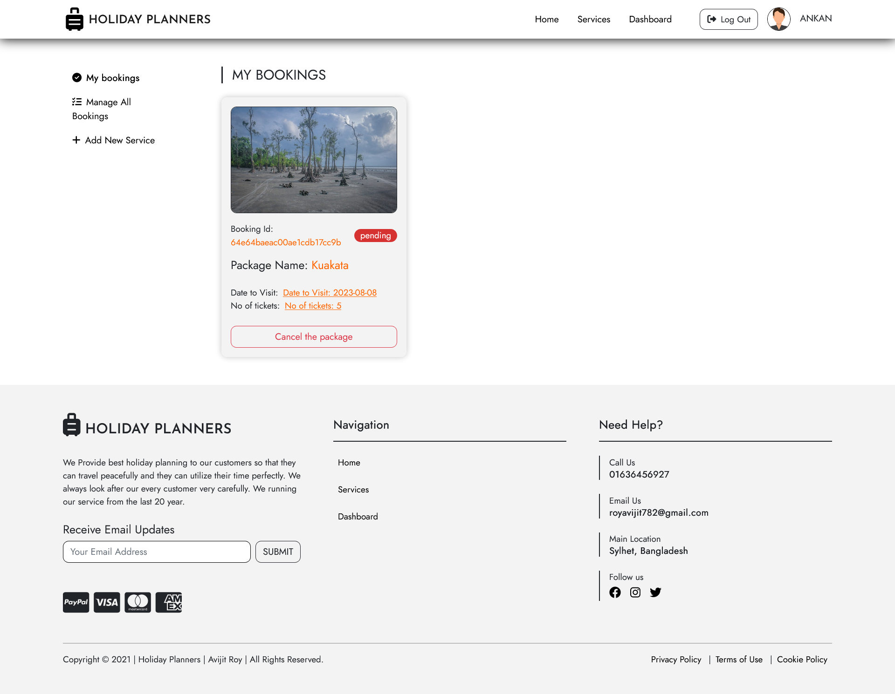
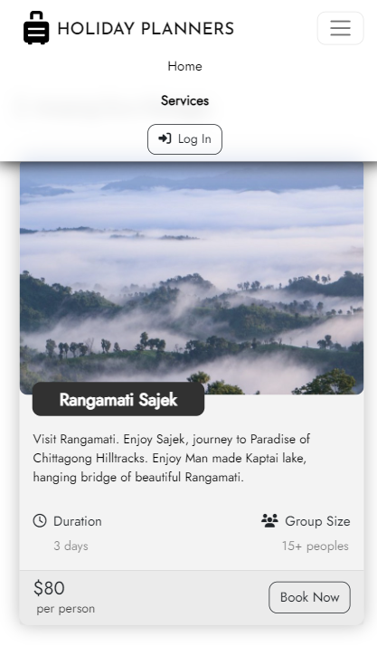

# Holiday-Planners -- a travel agency that can be used to travel many places in Bangladesh

*This was a task for a course of programming hero*

## Table of contents

- [Overview](#overview)
  - [Links](#links)
  - [The challenge](#the-challenge)
  - [Project features](#project-features)
  - [How to run](#how-to-run)
  - [Screenshots](#screenshots)
- [My process](#my-process)
  - [Built with](#built-with)
- [Author](#author)

## Overview

### Links

- Solution URL: [github link](https://github.com/ankan-782/Holiday-Planners-client-side)
- Live Site URL: [live site link](https://holiday-planner-bac0a.web.app/)

### The challenge

Users should be able to:

- View the optimal layout for the site depending on their device's screen size
- See hover states for all interactive elements on the page
- use navigation for navigating through sections.
- use mobile menu for navigating sections in tablet and mobile devices.
- Receive an error message when the footer subscribe now `form` is submitted if:
  - The `input` field is empty
  - The email address is not formatted correctly

### Project features

- This is the travel agency related website where customers books many travel package through this website called Holiday Planners.

- This website has basically 4 routes. Home, services, Dashboard and login-registration route. In Dashboard route there has extra 3 route which are My Bookings, Manage All Bookings, Add New Service. In every page there has a header for navigating every pages and there has a footer.

- In home page there has 5 sections which are banner section & some services, about us section, gallery section and our partners section.

- Then, in services section all packages available. Then package details will come when user clicks in Book Now Button. Then user see the details about the package and for booking this package user need to fill up the form. A user will not be able to book one service more than once.

- Then the booking information is shown to the My bookings section and Manage all bookings section. As mentioned above My bookings section, Manage All section and Add New service section is included in Dashboard section.

- Admin/User can delete the bookings from Manage All bookings section and can approve the any user's bookings by clicking the approve button. By approving the pending status will be cleared from both section which are My bookings section and Manage All section. Lastly Admin/User can add a new service by going to the Dashboard > Add New Service. Then Admin/user fill out the form to add a new service.

- Overall from this website any user can see header footer section, all the packages, About us section, Gallery section, Our partners section, Dashboard section, My Bookings section, Manage All Bookings section, Add new service section, login registration section, error 404 page.

### How to run

- Clone the repository:

```bash
git clone https://github.com/ankan-782/Holiday-Planners-client-side.git
```

- Navigate to the project directory:

```bash
cd Holiday-Planners-client-side
```

- Install dependencies:

```bash
npm install
```

- run the project:

```bash
npm start
```

### Screenshots

- landing page at larger devices


- services page at larger devices


- booking info page at larger devices



- login page at larger devices



- registration page at larger devices



- add new services page at larger devices



- all bookings list page at larger devices



- my bookings page with bookings at larger devices



- when navbar is opened at smaller devices



## My process

### Built with

- React Js
- Semantic JSX markup
- Bootstrap css framework
- Flex-box
- CSS Grid
- Position
- Mobile-first workflow
- Firebase authentication
- API integration
- MongoDB database
- Various npm packages

## Author

- Website - [Avijit Roy](https://avijit-roy-portfolio.netlify.app/)
- LinkedIn - [avijit-roy-ankan](https://www.linkedin.com/in/avijit-roy-ankan/)
- Twitter - [@AvijitAnkan](https://twitter.com/AvijitAnkan)
